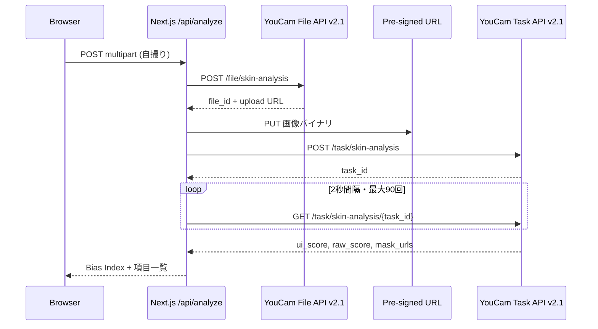

## TL;DR

YouCam Skin Analysis API は、1回の解析で **2種類のスコア** を同時に返します。

| フィールド | 役割 |
| --- | --- |
| **`raw_score`** | API が内部的に計算した測定値（小数） |
| **`ui_score`** | ユーザー向けに調整した表示用スコア（整数） |

公式ドキュメントは `ui_score` について、こう書いています。

> The UI Score functions primarily as a **psychological motivator** in beauty assessment. We adjust the raw scores to produce **more favorable results**, acknowledging that consumers generally prefer positive evaluations regarding their skin health.

つまり **意図的なキャリブレーション** です。バグでも丸め誤差でもありません。

私はこの設計を自分の顔で確認する Web アプリ **[Beauty Bias Lab](https://github.com/YOUR_USER/beauty_bias)** を Next.js で作りました。実装して分かったのは、**検出マスク（どこにシワ・毛穴があるか）は ui / raw で共通で、変わるのは数字だけ** という点です。

:::message alert
この記事は [Zennfes Spring 2026「YouCam APIを活用した実装事例とアイデア」](https://zenn.dev/contests/zennfes-spring-2026-perfect) への参加記事です。
:::

---

## なぜ Skin Analysis は2つのスコアを返すのか

美容アプリで「毛穴スコア 77点」と表示されるとき、多くのユーザーは **AI が測定したそのままの数字** だと思います。

YouCam API は、Skin Analysis のレスポンスで **測定値と表示値を分けて返す** 設計を取っています。

```
1回の解析
  ├── mask_urls   … どこにシワ・毛穴があるか（検出結果）
  ├── raw_score   … 内部の測定値
  └── ui_score    … ユーザーに見せる用に調整した値
```

**同じ検出結果に、2つのラベル** が付いているイメージです。

### raw_score — 何のためか

- AI モデルが直接出力した **生の解析スコア**
- 小数（例: 69.5、88.9）で返る
- Perfect Corp のブログでは **研究・精度重視の文脈** で使う想定が示唆されている
- 「絶対的真実」ではなく **API の推定値** である点に注意

### ui_score — 何のためか

- **ユーザー向けアプリの画面に出す点数**
- 整数（1〜100）に調整済み
- 公式定義: **心理的動機づけ**（psychological motivator）
- raw を **favorable（好意的）** な方向に調整し、利用継続・自信を支える UX を意図

開発者向けの使い分けはシンプルです。

| 文脈 | 使うスコア |
| --- | --- |
| 消費者向けアプリの UI | `ui_score` |
| 内部ログ・研究・精度重視 | `raw_score` |

---

## ui_score は何に使われ、何に使われないか

ここを誤解すると、Skin Analysis 全体の理解がズレます。

### 使われること

1. **画面表示** — 「水分量 77点」「毛穴 58点」など
2. **レコメンドの材料** — 「この項目は低めです」→ スキンケア商品の提案
3. **解説・チャットの入力** — スコアを LLM に渡してアドバイス文を生成（Perfect Corp 公式ブログにも例あり）
4. **エンゲージメント** — 厳しすぎる raw より、続けやすい ui を見せる

### 使われないこと

**ui_score は写真のピクセルを加工するパラメータではありません。**

Skin Analysis API は **分析する** API です。加工済みの美肌画像は返りません。

写真の色や形を変える **Makeup VTO や beautify 系 API** とは別物です。Makeup VTO の入力は **画像 + effects 配列**（`skinSmoothStrength: 50` など）であり、`ui_score` を渡すフィールドはありません。

```
Skin Analysis  →  「何点・どこに問題があるか」
Makeup VTO       →  「どう見せるか（メイク・スムージング）」
                   ↑ 別 API。ui_score は加工の強度スライダーではない
```

1つのアプリで両方使うことはありますが、**API が自動でつながっているわけではなく**、アプリ側のオーケストレーションです。Skin Analysis は計測タスクなので、**画像を変換しない** 点にも注意が必要です。

---

## 公式ドキュメントと公式サンプルの乖離

[AI Skin Analysis リファレンス](https://docs.perfectcorp.com/reference/ai_skin_analysis) の HD サンプル JSON だけでも、差は大きいです。

| 項目 | raw_score | ui_score | Δ (ui − raw) |
| --- | ---: | ---: | ---: |
| 鼻の毛穴 (`hd_pore.nose`) | 29.1 | 58 | **+28.9** |
| 水分量 (`hd_moisture`) | 48.7 | 70 | **+21.3** |
| 額のシワ (`hd_wrinkle.forehead`) | 56.0 | 67 | +11.0 |
| ハリ (`hd_firmness`) | 89.7 | 85 | **−4.7** |

読み取れること:

- **問題視されやすい部位**（毛穴・水分）ほど ui が **大きく持ち上がる** 傾向
- **すでに raw が高い項目**（ハリ）では ui を **下げる** ケースもある
- 「常に favorable に盛る」だけでは説明しきれない **項目別・得点帯別の調整**

`ui_score` は「優しさのための1本調整」ではなく、**表示ポリシー** として機能しています。

---

## 実装して分かったこと：変わるのはスコアだけ

Beauty Bias Lab を作る前、私は「raw 用と ui 用で別マスクが返るのでは？」と想像していました。

**実際は違いました。**

`mask_urls` は **ui / raw で共通** です。どこにシワ・毛穴があるかという **検出結果は1種類** で、**付与される数字だけが2種類** です。

> 同じ顔、同じマスク。変わるのはスコアだけ。

これはドキュメントを読むだけでは実感しにくいので、自撮り1枚で並べて見せるデモにしました。

### 実機の一例

<!-- TODO: 公開範囲に注意してスクショ差し替え -->

| 項目 | raw | ui | Δ | 読み方 |
| --- | ---: | ---: | ---: | --- |
| 目周りのシワ | 88.9 | 80 | **−8.9** | 検出は同じ。表示だけ厳しめ |
| 水分量 | 69.5 | 77 | **+7.5** | 検出は同じ。表示だけ良く見せる |
| ニキビ | 83.0 | 89 | +6.0 | 同上 |
| シワ（全体） | 94.1 | 88 | −6.1 | raw が高いのに ui を下げる |

14項目の Bias Index（ΣΔ）は **−19.9** でした。表示用スコアが raw より **全体的に低め** に調整されている、という1枚の顔の「表示レシート」です。

---

## 2つのスコアが示す「設計思想」

YouCam API の Introduction は beautify や true-to-life を謳います。Skin Analysis だけ切り取ると「計測」「科学的」に読めます。

しかし `ui_score` の存在は、**計測結果をそのまま見せない設計** であることを API 自身が認めています。

ここで押さえる3点:

1. **検出（mask）と表示（ui_score）は分離されている** — 同じシワを検出したまま、見せる点数だけ変えられる
2. **ui_score は UX 設計の一部** — 心理的動機づけ、離脱防止、自信の付与
3. **raw_score も「真実」ではない** — それでも ui との **差分 Δ** は「表示ポリシー」の差として読める

美容テックの UI で「AI が測った点数」と見えるものは、**必ずしも測定値そのものではない** — Skin Analysis API は、その構造を **レスポンスに両方載せて返す**  rare な例です。

---

## Beauty Bias Lab — 2つのスコアを自分の顔で確かめる

### デモ

<!-- TODO: デプロイ後に差し替え -->
- デモ URL: `https://YOUR_DEMO_URL`
- リポジトリ: `https://github.com/YOUR_USER/beauty_bias`

<!-- TODO: スクリーンショット -->
<!--  -->

自撮りをアップロードすると:

- 部位ごとに **測定値 → 表示用** の差分 Δ
- **Bias Index**（全項目の ΣΔ）
- **表示を上げた / 下げた** 項目のグループ分け
- 同一マスク上で「2つの見せ方」を並べた比較 UI

「肌診断アプリ」ではなく、**API の表示設計を可視化する実験ツール** です。

### アーキテクチャ

Skin Analysis **v2.1 のみ**。LLM も Makeup VTO も使いません。



| レイヤ | 技術 | 役割 |
| --- | --- | --- |
| フロント | Next.js 15 (App Router) + React 19 | アップロード、乖離の可視化 |
| BFF | `/api/analyze` | API Key 隠蔽、Polling 集約 |
| 外部 API | Skin Analysis v2.1 | HD 5項目（`hd_wrinkle`, `hd_pore` 等） |

---

## 実装の要点

### API 呼び出し（4ステップ）

1. File API でメタデータ POST → `file_id` + pre-signed URL
2. **PUT** で画像アップロード（ここを忘れると失敗）
3. Task API で `dst_actions` 指定 → `task_id`
4. GET で Poll、`task_status === "success"` まで待つ

https://docs.perfectcorp.com/develop/quick_start_guide

```typescript
// lib/perfectcorp.ts（抜粋）
const HD_ACTIONS = [
  "hd_wrinkle",
  "hd_pore",
  "hd_texture",
  "hd_moisture",
  "hd_acne",
] as const;

await apiFetch("/s2s/v2.1/task/skin-analysis", {
  method: "POST",
  body: JSON.stringify({
    src_file_id: fileId,
    dst_actions: [...HD_ACTIONS],
    format: "json",
  }),
});
```

:::message
HD と SD の `dst_actions` は **混在不可**。`hd_` を使うならすべて HD に揃えてください。
:::

### 乖離の計算

```typescript
// app/api/analyze/route.ts（抜粋）
const items = output.map((row) => ({
  uiScore: row.ui_score ?? 0,
  rawScore: row.raw_score ?? 0,
  delta: (row.ui_score ?? 0) - (row.raw_score ?? 0),
  maskUrl: row.mask_urls?.[0] ?? null,
})).sort((a, b) => Math.abs(b.delta) - Math.abs(a.delta));

const biasIndex = items.reduce((sum, i) => sum + i.delta, 0);
// biasIndex = Σ(ui_score - raw_score)
```

**Bias Index** は「この1枚の顔について、表示用スコアが raw から合計どれだけズレているか」の指標です。肌の良し悪しそのものではありません。

### レスポンスのフラット化

v2.1 の JSON 出力はネスト構造（`hd_wrinkle.forehead`, `hd_pore.nose` 等）なので、部位ごとに `type` を一意化してから Δ を計算しています。同一 `type` の重複キー問題もここで解消します。

---

## UI：2つのスコアを「見える化」する

フロントエンドの設計方針:

1. **結論ファースト** — 「検出は同じ、表示スコアだけズレた」を要約
2. **測定値 → 表示用** の矢印 UI — 項目ごとに Δ を明示
3. **同一マスクの比較** — 「測定値を見せた場合」と「美容アプリが見せる場合」を並べ、**写真は同じコピー** であることを注釈
4. **上方 / 下方** でグループ分け — 調整の方向が項目によって異なることを見せる

`raw_score` / `ui_score` という API フィールド名は折りたたみ内に退避し、画面上は **測定値 / 表示用** と日本語化しています。

---

## ハマったポイント

### dev サーバー

```json
"dev": "WATCHPACK_POLLING=true next dev --hostname 127.0.0.1 --port 3000"
```

`.next` キャッシュ破損時は API が HTML エラーを返し、フロントで `Unexpected token '<'` になります。`rm -rf .next` して再起動。

### 環境変数

```bash
# .env.local（Next.js が読むのはこちら）
PERFECTCORP_API_KEY=sk-...
```

v2.1 s2s API は Bearer Token の **API Key のみ** で動作します。

### 入力画像

- 正面向き・明るい照明
- **顔が画像幅の 60% 以上**（`error_src_face_too_small` の主因）
- HD は短辺 1080px 以上推奨

### 分析時間・コスト

30〜60秒。Route Handler に `maxDuration = 120`。HD 5項目で **1回のアップロード = 1 unit 消費**。

---

## 開発者への示唆：どちらを見せるか

Skin Analysis API が両方返してくれるからこそ、**プロダクト設計の選択** が生まれます。

| 選択 | 意味 |
| --- | --- |
| ui のみ表示 | 公式想定どおり。ユーザーに優しい UX |
| raw も開示 | 透明性重視。信頼構築 |
| 両方表示 | Beauty Bias Lab 方式。教育・批評向け |

「AI が測った点数」と UI に出すものは **同じではない** — この API は、その事実を **データで教えてくれる** 側です。

---

## まとめ

- Skin Analysis API は **1回の解析で `raw_score` と `ui_score` を同時に返す**
- **`raw_score`** = 内部測定値。**`ui_score`** = ユーザー向けに調整した表示用スコア（心理的動機づけ）
- **検出マスクは共通**。変わるのは数字だけ
- **ui_score は写真加工のパラメータではない**。分析と beautify は別 API
- **Beauty Bias Lab** は、その乖離を自分の顔で確かめる可視化ツール

> 同じ顔、同じマスク。変わるのはスコアだけ。

ドキュメントに書いてあったことを、スクショ1枚で証明する——それが今回の記事とデモの狙いです。

---

## 参考リンク

- [Zennfes Spring 2026 / YouCam API コンテスト](https://zenn.dev/contests/zennfes-spring-2026-perfect)
- [YouCam API Developer Guide](https://docs.perfectcorp.com/develop/introduction)
- [AI Skin Analysis リファレンス](https://docs.perfectcorp.com/reference/ai_skin_analysis)
- [Quick Start Guide](https://docs.perfectcorp.com/develop/quick_start_guide)
- [Build a Skincare App Using Claude and YouCam Skin Analysis API](https://www.perfectcorp.com/business/blog/ai-skincare/skin-analysis-api-claude-mcp-integration)（ui / raw の使い分け解説）
- [Beauty Bias Lab リポジトリ](https://github.com/YOUR_USER/beauty_bias) <!-- TODO -->

---

## 公開前チェックリスト

- [ ] デモ URL をデプロイ（Vercel 推奨）してリンク差し替え
- [ ] GitHub リポジトリを public にしてリンク差し替え
- [ ] 自撮り結果スクショを2〜3枚挿入（**公開してよい画像のみ**）
- [ ] 記事末尾の `YOUR_USER` / `YOUR_DEMO_URL` を置換
- [ ] Zenn 公開後、「コンテストに応募する」から本テーマを選択

---

## 提案タイトル（候補）

1. **同じ顔、同じマスク。変わるのはスコアだけ — YouCam Skin Analysis の ui_score と raw_score を読み解く**（推奨）
2. ui_score は何のため？ raw_score との違いを Beauty Bias Lab で可視化した
3. 「APIドキュメントに書いてあった」── 美容 API が返す2つの点数の意味と使い分け
