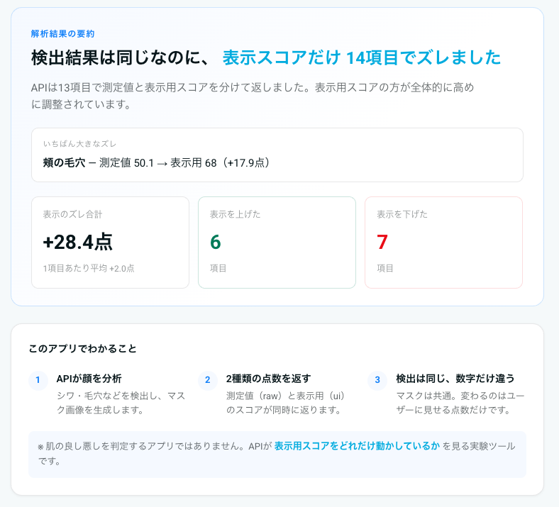
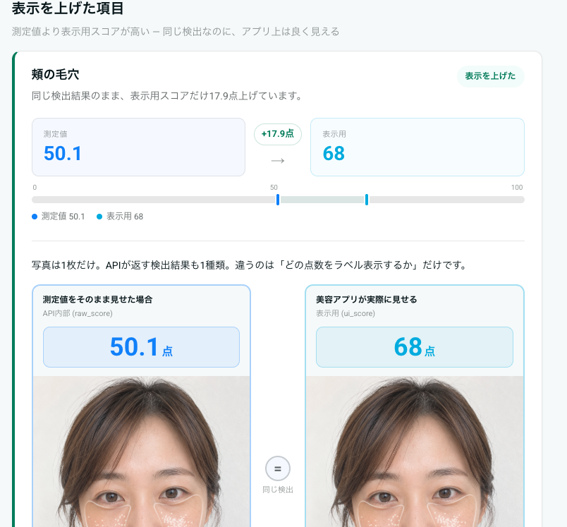
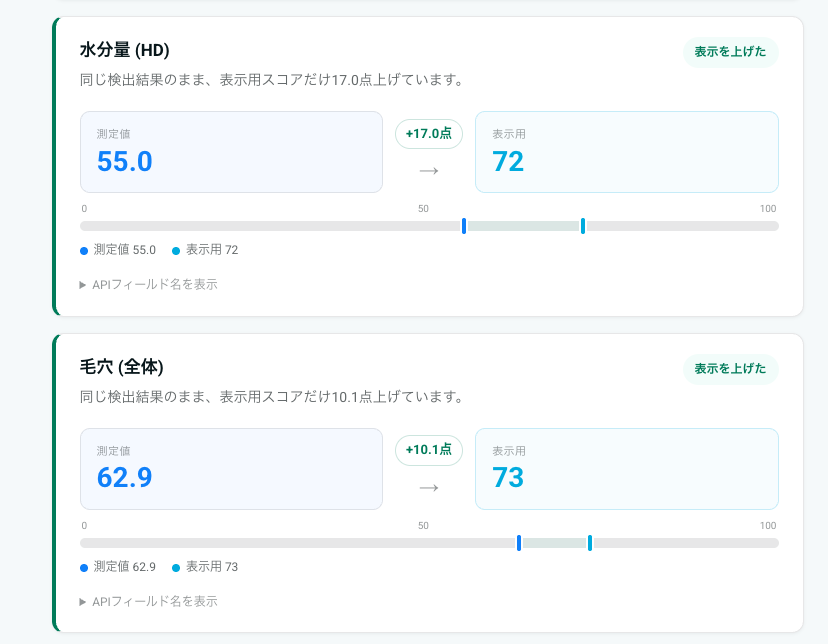
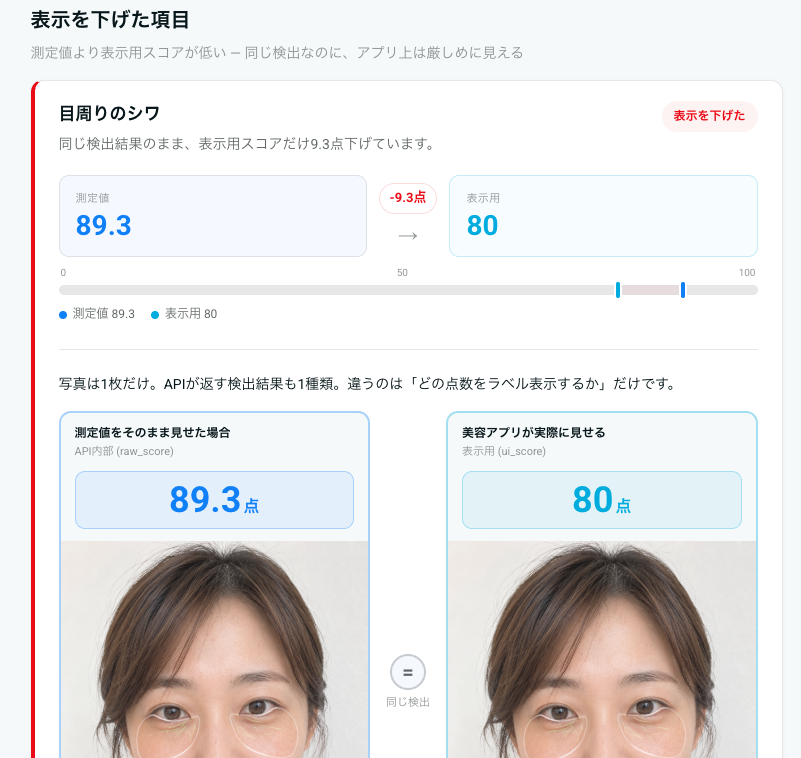
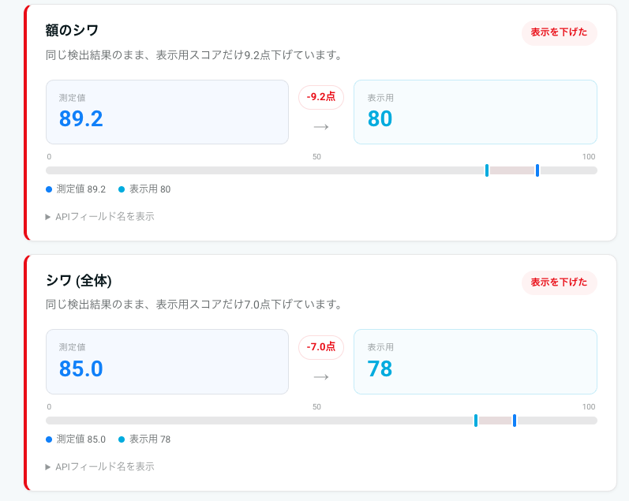
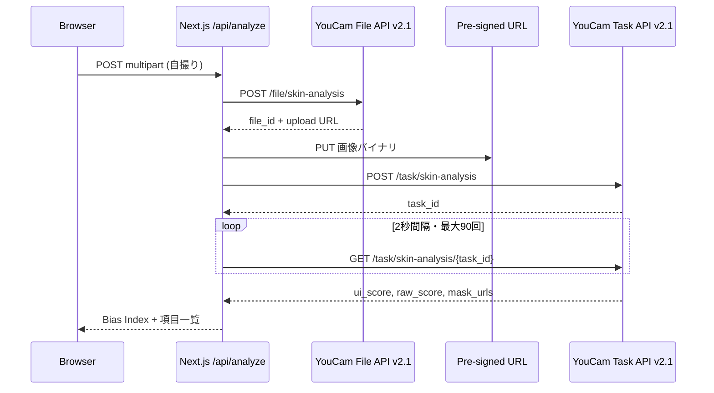

## TL;DR

YouCam 肌分析 API（Skin Analysis）は、1回の解析で **2種類の点数** を同時に返します。

| フィールド | 意味 |
| --- | --- |
| **raw_score** | API が内部で計算した測定値（小数） |
| **ui_score** | 画面に出す用に調整した点数（整数） |

公式ドキュメントは `ui_score` について、こう書いています。

> The UI Score functions primarily as a **psychological motivator** in beauty assessment. We adjust the raw scores to produce **more favorable results**, acknowledging that consumers generally prefer positive evaluations regarding their skin health.

要するに **意図的な調整** です。バグでも、四捨五入の誤差でもありません。

この仕組みを自分の顔で確かめる Web アプリ **[Beauty Bias Lab](https://beauty-bias-lab.vercel.app/)** を Next.js で作りました。触って分かったのは、**「どこにシワ・毛穴があるか」の分析結果は共通で、変わるのは点数だけ** という点です。

:::message alert
この記事は [Zennfes Spring 2026「YouCam APIを活用した実装事例とアイデア」](https://zenn.dev/contests/zennfes-spring-2026-perfect) への参加記事です。
:::

---

## なぜ肌分析 API は2つの点数を返すのか

美容アプリで「毛穴スコア 77点」と出るとき、多くの人は **AI が測ったそのままの数字** だと思います。

YouCam API は、肌分析の結果として **測定値と表示用の点数を分けて返す** 設計です。

```
1回の解析
  ├── mask_urls   … どこにシワ・毛穴があるか（API上のフィールド名）
  ├── raw_score   … 内部の測定値
  └── ui_score    … 画面に出す用に調整した値
```

`mask_urls` は API の都合上こう呼ばれていますが、中身は **シワや毛穴の位置を色付きで重ねた分析画像** です。美容業界でいう「マスク（シートマスク）」とは別物です。

**同じ分析結果に、2種類の点数が付いている** イメージです。

### raw_score — 何のためか

- AI が直接出した **生の測定値**
- 小数（例: 69.5、88.9）で返る
- Perfect Corp のブログでは **研究・精度重視** の用途を想定している
- 「絶対的な真実」ではなく **API の推定値** である点に注意

### ui_score — 何のためか

- **ユーザー向けアプリの画面に出す点数**
- 整数（1〜100）に調整済み
- 公式の説明: **心理的な動機づけ**（psychological motivator）
- 測定値を **良く見える方向** に調整し、使い続けてもらう・自信を持ってもらう UX を意図

開発者としての使い分けはシンプルです。

| 場面 | 使う点数 |
| --- | --- |
| 一般ユーザー向けアプリの画面 | `ui_score` |
| 内部ログ・研究・精度重視 | `raw_score` |

---

## ui_score は何に使われ、何に使われないか

ここを誤解すると、肌分析 API 全体の理解がズレます。

### 使われること

1. **画面表示** — 「水分量 77点」「毛穴 58点」など
2. **おすすめの材料** — 「この項目は低めです」→ スキンケア商品の提案
3. **解説・チャットの入力** — 点数を LLM に渡してアドバイス文を生成（Perfect Corp 公式ブログにも例あり）
4. **続けてもらうため** — 厳しすぎる測定値より、続けやすい表示用点数を見せる

### 使われないこと

**ui_score は、写真をきれいに加工するための設定値ではありません。**

肌分析 API は **分析する** API です。美肌に加工した画像は返りません。

写真の色や形を変える **メイク試着（Makeup VTO）や beautify 系 API** とは別物です。Makeup VTO の入力は **画像 + effects 配列**（`skinSmoothStrength: 50` など）であり、`ui_score` を渡す欄はありません。

```
肌分析 API     →  「何点・どこに気になる箇所があるか」
メイク試着 API  →  「どう見せるか（メイク・肌補正）」
                   ↑ 別 API。ui_score は加工の強さのつまみではない
```

1つのアプリで両方使うことはありますが、**API が自動でつながっているわけではなく**、アプリ側で組み合わせる必要があります。肌分析は計測用なので、**画像そのものは変えない** 点にも注意が必要です。

---

## 参考：公式ドキュメントのサンプル JSON

:::message
以下の表は **[AI Skin Analysis リファレンス](https://docs.perfectcorp.com/reference/ai_skin_analysis) に掲載されているサンプル JSON** の値です。特定の実在人物の顔を解析した結果ではありません。あくまで「API が返しうる差の例」として読んでください。
:::

HD サンプル JSON だけでも、差ははっきりしています。

| 項目 | raw_score | ui_score | 差 (ui − raw) |
| --- | ---: | ---: | ---: |
| 鼻の毛穴 (`hd_pore.nose`) | 29.1 | 58 | **+28.9** |
| 水分量 (`hd_moisture`) | 48.7 | 70 | **+21.3** |
| 額のシワ (`hd_wrinkle.forehead`) | 56.0 | 67 | +11.0 |
| ハリ (`hd_firmness`) | 89.7 | 85 | **−4.7** |

読み取れること:

- **気になりやすい部位**（毛穴・水分）ほど、表示用点数が **大きく上がる** 傾向
- **もともと測定値が高い項目**（ハリ）では、表示用点数を **下げる** ケースもある
- 「常に良く見せる」だけでは説明しきれない **項目ごと・点数帯ごとの調整**

`ui_score` は「優しく見せるための1本調整」ではなく、**画面にどう見せるかのルール** として機能しています。

---

## 作って分かったこと：変わるのは点数だけ

Beauty Bias Lab を作る前、私は「測定値用と表示用で、別々の分析画像が返るのでは？」と想像していました。

**実際は違いました。**

`mask_urls`（どこにシワ・毛穴があるかを示す分析画像）は **ui / raw で共通** です。**気になる箇所の検出結果は1種類** で、**付いている点数だけが2種類** です。

> 同じ顔、同じ分析結果。変わるのは点数だけ。

これはドキュメントを読むだけでは実感しにくいので、自撮り1枚で並べて見せるデモ **[Beauty Bias Lab](https://beauty-bias-lab.vercel.app/)** を作りました。

---

## Beauty Bias Lab で自分の顔を試した

:::message
ここから先は **私が Beauty Bias Lab に自撮り1枚をアップロードした実測結果** です。上の「公式サンプル JSON」とは別データです。
:::

### Bias Index（表示のズレ合計）の読み方

Beauty Bias Lab は、解析で返ってきた **全項目** について次を計算します。

```
各項目の差 = ui_score − raw_score
Bias Index = 全項目の差を足した合計
```

例えば 14 項目あれば、**14 個の差を全部足した数字** が Bias Index です。肌の良し悪しそのものではなく、「この1枚の顔について、表示用点数が測定値から **合計どれだけズレているか**」の指標です。

今回の結果:

- **Bias Index: +28.4 点**（14 項目の差の合計）
- **1 項目あたり平均: +2.0 点**
- **表示を上げた項目: 6** / **下げた項目: 7**

### 解析結果の要約



### 差が大きかった項目（抜粋）

14 項目すべてを載せると長くなるので、**差の絶対値が大きかった 6 項目** だけ抜粋します。Bias Index +28.4 は、この 14 項目 **全部** の合計です（下表はその一部）。

| 項目 | 測定値 (raw) | 表示用 (ui) | 差 (ui − raw) | 読み方 |
| --- | ---: | ---: | ---: | --- |
| 頬の毛穴 | 50.1 | 68 | **+17.9** | 気になりやすい部位。表示を大きく上げる |
| 水分量 | 55.0 | 72 | **+17.0** | 同上 |
| 毛穴（全体） | 62.9 | 73 | +10.1 | 同上 |
| 目周りのシワ | 89.3 | 80 | **−9.3** | 測定値が高いのに表示用を下げる |
| 額のシワ | 89.2 | 80 | −9.2 | 同上 |
| シワ（全体） | 85.0 | 78 | −7.0 | 同上 |

公式サンプル JSON と同じく、**気になりやすい部位（毛穴・水分）は表示を上げ、もともと測定値が高い項目（シワ）は下げる** 傾向が見えます。「常に良く見せる」だけでは説明できません。**項目によって上げたり下げたりする** — これがスクショで一目で分かります。

---

## 2つの点数が示す設計の意図

YouCam API の Introduction は beautify や true-to-life を謳っています。肌分析だけ切り取ると「計測」「科学的」に読めます。

しかし `ui_score` の存在は、**測定結果をそのまま見せない設計** であることを API 自身が認めています。

ここで押さえる3点:

1. **検出結果と表示用点数は分離されている** — 同じシワを検出したまま、見せる点数だけ変えられる
2. **ui_score は UX 設計の一部** — 心理的な動機づけ、離脱防止、自信の付与
3. **raw_score も「真実」ではない** — それでも ui との **差** は「画面の見せ方の違い」として読める

美容アプリの UI で「AI が測った点数」と見えるものは、**必ずしも測定値そのものではない** — 肌分析 API は、その構造を **レスポンスに両方載せて返す** 珍しい例です。

---

## Beauty Bias Lab — 2つの点数を自分の顔で確かめる

### デモ

- **デモ URL:** [https://beauty-bias-lab.vercel.app/](https://beauty-bias-lab.vercel.app/)
- **リポジトリ:** [https://github.com/rushhirosan/beauty_bias](https://github.com/rushhirosan/beauty_bias)

自撮りをアップロードすると:

- 部位ごとに **測定値 → 表示用** の差
- **表示のズレ合計（Bias Index）** — 全項目の差を足した値
- **表示を上げた / 下げた** 項目のグループ分け
- **同じ分析画像** 上で「2つの見せ方」を並べた比較 UI

「肌診断アプリ」ではなく、**API が点数をどう見せているかを可視化する実験ツール** です。

### 画面の見どころ

#### 表示を上げた項目 — 同じ検出なのに点数だけ上がる





#### 表示を下げた項目 — 測定値が高いのに厳しめに見せる





1枚目の項目カードだけ、左右に **同じ写真・同じ分析画像** を並べた比較 UI が出ます。「測定値をそのまま見せた場合」と「美容アプリが実際に見せる場合」の違いが、**顔の見た目ではなく点数だけ** で伝わるようにしています。

### 全体構成

肌分析 **v2.1 のみ** を使います。LLM も Makeup VTO も使いません。



| 部分 | 技術 | 役割 |
| --- | --- | --- |
| フロント | Next.js 15 (App Router) + React 19 | アップロード、ズレの可視化 |
| サーバー | `/api/analyze` | API Key の隠蔽、ポーリングの集約 |
| 外部 API | Skin Analysis v2.1 | HD 5項目（`hd_wrinkle`, `hd_pore` 等） |

---

## 実装の要点

### API 呼び出し（4ステップ）

1. File API でメタデータ POST → `file_id` + アップロード用 URL
2. **PUT** で画像アップロード（File API の POST だけでは足りない — 詳細は「ハマったポイント」参照）
3. Task API で `dst_actions` 指定 → `task_id`
4. GET でポーリング、`task_status === "success"` まで待つ

[Quick Start Guide](https://docs.perfectcorp.com/develop/quick_start_guide)

```typescript
// lib/perfectcorp.ts（抜粋）
const HD_ACTIONS = [
  "hd_wrinkle",
  "hd_pore",
  "hd_texture",
  "hd_moisture",
  "hd_acne",
] as const;

await apiFetch("/s2s/v2.1/task/skin-analysis", {
  method: "POST",
  body: JSON.stringify({
    src_file_id: fileId,
    dst_actions: [...HD_ACTIONS],
    format: "json",
  }),
});
```

:::message
HD と SD の `dst_actions` は **混在不可**。`hd_` を使うならすべて HD に揃えてください。
:::

### ズレの計算

```typescript
// app/api/analyze/route.ts（抜粋）
const items = output.map((row) => ({
  uiScore: row.ui_score ?? 0,
  rawScore: row.raw_score ?? 0,
  delta: (row.ui_score ?? 0) - (row.raw_score ?? 0),
  maskUrl: row.mask_urls?.[0] ?? null,
}));

const biasIndex = items.reduce((sum, i) => sum + i.delta, 0);
// biasIndex = 全項目の (ui_score - raw_score) の合計
```

```typescript
// components/BiasResults.tsx（抜粋）
const inflated = items
  .filter((i) => i.delta > 0.5)
  .sort((a, b) => b.delta - a.delta);
const deflated = items
  .filter((i) => i.delta < -0.5)
  .sort((a, b) => a.delta - b.delta);
```

**Bias Index（表示のズレ合計）** の定義は「Beauty Bias Lab で自分の顔を試した」節で説明したとおり、全項目の `(ui_score − raw_score)` の合計です。

### レスポンスの整理

v2.1 の JSON 出力はネスト構造（`hd_wrinkle.forehead`, `hd_pore.nose` 等）なので、部位ごとに `type` を一意化してから差を計算しています。同一 `type` の重複キー問題もここで解消します。

---

## UI：2つの点数を「見える化」する

画面の設計方針:

1. **結論ファースト** — 「検出は同じ、表示用点数だけズレた」を要約
2. **測定値 → 表示用** の矢印 UI — 項目ごとに差を明示
3. **同じ分析画像での比較** — 「測定値をそのまま見せた場合」と「美容アプリが実際に見せる場合」を並べ、**写真は同じ** であることを注釈
4. **上げた / 下げた** でグループ分け — 上げ幅・下げ幅の大きい順に並べ、調整の方向が項目によって異なることを見せる

`raw_score` / `ui_score` という API のフィールド名は折りたたみ内に退避し、画面上は **測定値 / 表示用** と日本語化しています。

---

## ハマったポイント

YouCam Skin Analysis を初めて触るとき、ドキュメントを読んでも **File API の POST だけでは画像はアップロードされない** 点でつまずきやすいです。ここが最大のハマりどころでした。

### File API の POST と PUT は別処理

Quick Start の流れは 4 ステップですが、実際には **「メタデータ登録」と「画像本体のアップロード」が分かれている** のがポイントです。

```
① POST /file/skin-analysis   → file_id と pre-signed URL を取得
② PUT  pre-signed URL        → 画像バイナリを別途アップロード  ← ここを忘れると失敗
③ POST /task/skin-analysis   → file_id を渡して解析タスク作成
④ GET  /task/skin-analysis/{task_id}  → 完了までポーリング
```

①だけ実行して ③ に進むと、Task API 側には `file_id` しか渡っていないのに **画像本体が S3 に存在しない** 状態になります。エラーメッセージも分かりにくく、「API Key は合っているのに動かない」という症状になりがちです。

Beauty Bias Lab では、PUT を明示的に分けています。

```typescript
// lib/perfectcorp.ts（抜粋）
const { fileId, uploadUrl, uploadHeaders } = await initFileUpload(
  apiKey, fileName, contentType, buffer.length,
);

await uploadToPresignedUrl(uploadUrl, buffer, uploadHeaders); // ← PUT が必須

const taskId = await createSkinAnalysisTask(apiKey, fileId);
```

:::message
pre-signed URL への PUT は **YouCam API ではなく S3 側** へのリクエストです。`Content-Type` ヘッダーを File API のレスポンスどおりに付ける必要があります。
:::

### そのほか、実装で詰まりやすい点

**HD と SD の `dst_actions` は混在不可。** `hd_wrinkle` を使うなら、すべて `hd_` プレフィックスに揃えてください。

**顔が小さすぎると `error_src_face_too_small`。** 正面向き・明るい照明で、顔が画像幅の 60% 以上を占める写真を使うと安定します。HD は短辺 1080px 以上推奨。

**解析は 30〜60 秒かかる。** Route Handler に `maxDuration = 120` を設定し、Task API を 2 秒間隔でポーリングしています。HD 5 項目で **1 回のアップロード = 1 unit 消費** です。

**API Key の渡し方。** v2.1 s2s API は Bearer Token の API Key のみで動作します。Beauty Bias Lab は **訪問者が各自の API Key を入力する方式**（Bring Your Own Key）なので、本番（Vercel）でもサーバー側にキーを置く必要はありません。ローカル開発用に `.env.local` に `PERFECTCORP_API_KEY` を置くこともできます。

---

## 開発者への示唆：どちらを見せるか

肌分析 API が両方返してくれるからこそ、**プロダクト設計の選択** が生まれます。

| 選択 | 意味 |
| --- | --- |
| ui のみ表示 | 公式想定どおり。ユーザーに優しい UX |
| raw も開示 | 透明性重視。信頼構築 |
| 両方表示 | Beauty Bias Lab 方式。教育・批評向け |

「AI が測った点数」と画面に出すものは **同じではない** — この API は、その事実を **データで教えてくれる** 側です。

---

## まとめ

- 肌分析 API は **1回の解析で `raw_score` と `ui_score` を同時に返す**
- **raw_score** = 内部の測定値。**ui_score** = 画面用に調整した点数（心理的な動機づけ）
- **気になる箇所の分析結果は共通**。変わるのは点数だけ
- **ui_score は写真加工の設定値ではない**。分析と beautify は別 API
- **Bias Index** = 全項目の `(ui_score − raw_score)` の合計。肌の良し悪しではなく「表示のズレ」の指標

> 同じ顔、同じ分析結果。変わるのは点数だけ。

ドキュメントに書いてあったことを、自分の顔のスクショ1枚で確かめてみてください。

- **デモ:** [https://beauty-bias-lab.vercel.app/](https://beauty-bias-lab.vercel.app/)
- **ソースコード:** [https://github.com/rushhirosan/beauty_bias](https://github.com/rushhirosan/beauty_bias)

---

## 参考リンク

- [Zennfes Spring 2026 / YouCam API コンテスト](https://zenn.dev/contests/zennfes-spring-2026-perfect)
- [Beauty Bias Lab（デモ）](https://beauty-bias-lab.vercel.app/)
- [Beauty Bias Lab リポジトリ](https://github.com/rushhirosan/beauty_bias)
- [YouCam API Developer Guide](https://docs.perfectcorp.com/develop/introduction)
- [AI Skin Analysis リファレンス](https://docs.perfectcorp.com/reference/ai_skin_analysis)
- [Quick Start Guide](https://docs.perfectcorp.com/develop/quick_start_guide)
- [Build a Skincare App Using Claude and YouCam Skin Analysis API](https://www.perfectcorp.com/business/blog/ai-skincare/skin-analysis-api-claude-mcp-integration)（ui / raw の使い分け解説）

---

## 公開前チェックリスト

- [x] デモ URL をデプロイしてリンク差し替え
- [x] GitHub リポジトリを public にしてリンク差し替え
- [x] 自撮り結果スクショを挿入（`docs/images/` に保存済み）
- [ ] Zenn エディタに画像をアップロード（`docs/images/*.png` をドラッグ&ドrop）
- [ ] Zenn 公開後、「コンテストに応募する」から本テーマを選択

---

## 提案タイトル（候補）

1. **同じ顔、同じ分析結果。変わるのは点数だけ — YouCam 肌分析 API の ui_score と raw_score**（推奨）
2. ui_score って何のため？ 測定値との違いを Beauty Bias Lab で確かめた
3. 「API ドキュメントに書いてあった」── 美容 API が返す2つの点数の意味と使い分け
