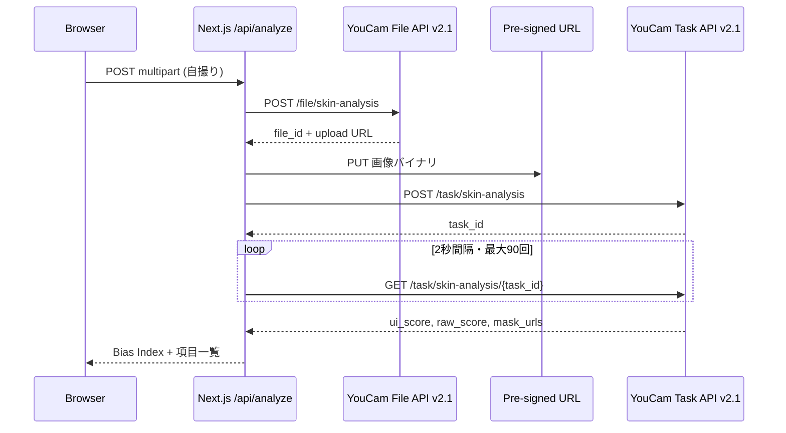

## TL;DR

YouCam 肌分析 API（Skin Analysis）は、1回の解析で **2種類の点数** を同時に返します。


| フィールド           | 意味                  |
| --------------- | ------------------- |
| `**raw_score`** | API が内部で計算した測定値（小数） |
| `**ui_score**`  | 画面に出す用に調整した点数（整数）   |


公式ドキュメントは `ui_score` について、こう書いています。

> The UI Score functions primarily as a **psychological motivator** in beauty assessment. We adjust the raw scores to produce **more favorable results**, acknowledging that consumers generally prefer positive evaluations regarding their skin health.

要するに **意図的な調整** です。バグでも、四捨五入の誤差でもありません。

この仕組みを自分の顔で確かめる Web アプリ **[Beauty Bias Lab](https://github.com/YOUR_USER/beauty_bias)** を Next.js で作りました。触って分かったのは、**「どこにシワ・毛穴があるか」の分析結果は共通で、変わるのは点数だけ** という点です。

:::message alert
この記事は [Zennfes Spring 2026「YouCam APIを活用した実装事例とアイデア」](https://zenn.dev/contests/zennfes-spring-2026-perfect) への参加記事です。
:::

---

## なぜ肌分析 API は2つの点数を返すのか

美容アプリで「毛穴スコア 77点」と出るとき、多くの人は **AI が測ったそのままの数字** だと思います。

YouCam API は、肌分析の結果として **測定値と表示用の点数を分けて返す** 設計です。

```
1回の解析
  ├── mask_urls   … どこにシワ・毛穴があるか（API上のフィールド名）
  ├── raw_score   … 内部の測定値
  └── ui_score    … 画面に出す用に調整した値
```

`mask_urls` は API の都合上こう呼ばれていますが、中身は **シワや毛穴の位置を色付きで重ねた分析画像** です。美容業界でいう「マスク（シートマスク）」とは別物です。

**同じ分析結果に、2種類の点数が付いている** イメージです。

### raw_score — 何のためか

- AI が直接出した **生の測定値**
- 小数（例: 69.5、88.9）で返る
- Perfect Corp のブログでは **研究・精度重視** の用途を想定している
- 「絶対的な真実」ではなく **API の推定値** である点に注意

### ui_score — 何のためか

- **ユーザー向けアプリの画面に出す点数**
- 整数（1〜100）に調整済み
- 公式の説明: **心理的な動機づけ**（psychological motivator）
- 測定値を **良く見える方向** に調整し、使い続けてもらう・自信を持ってもらう UX を意図

開発者としての使い分けはシンプルです。


| 場面             | 使う点数        |
| -------------- | ----------- |
| 一般ユーザー向けアプリの画面 | `ui_score`  |
| 内部ログ・研究・精度重視   | `raw_score` |


---

## ui_score は何に使われ、何に使われないか

ここを誤解すると、肌分析 API 全体の理解がズレます。

### 使われること

1. **画面表示** — 「水分量 77点」「毛穴 58点」など
2. **おすすめの材料** — 「この項目は低めです」→ スキンケア商品の提案
3. **解説・チャットの入力** — 点数を LLM に渡してアドバイス文を生成（Perfect Corp 公式ブログにも例あり）
4. **続けてもらうため** — 厳しすぎる測定値より、続けやすい表示用点数を見せる

### 使われないこと

**ui_score は、写真をきれいに加工するための設定値ではありません。**

肌分析 API は **分析する** API です。美肌に加工した画像は返りません。

写真の色や形を変える **メイク試着（Makeup VTO）や beautify 系 API** とは別物です。Makeup VTO の入力は **画像 + effects 配列**（`skinSmoothStrength: 50` など）であり、`ui_score` を渡す欄はありません。

```
肌分析 API     →  「何点・どこに気になる箇所があるか」
メイク試着 API  →  「どう見せるか（メイク・肌補正）」
                   ↑ 別 API。ui_score は加工の強さのつまみではない
```

1つのアプリで両方使うことはありますが、**API が自動でつながっているわけではなく**、アプリ側で組み合わせる必要があります。肌分析は計測用なので、**画像そのものは変えない** 点にも注意が必要です。

---

## 公式サンプルでも、2つの点数には大きな差がある

[AI Skin Analysis リファレンス](https://docs.perfectcorp.com/reference/ai_skin_analysis) の HD サンプル JSON だけでも、差ははっきりしています。


| 項目                           | raw_score | ui_score | 差 (ui − raw) |
| ---------------------------- | --------- | -------- | ------------ |
| 鼻の毛穴 (`hd_pore.nose`)        | 29.1      | 58       | **+28.9**    |
| 水分量 (`hd_moisture`)          | 48.7      | 70       | **+21.3**    |
| 額のシワ (`hd_wrinkle.forehead`) | 56.0      | 67       | +11.0        |
| ハリ (`hd_firmness`)           | 89.7      | 85       | **−4.7**     |


読み取れること:

- **気になりやすい部位**（毛穴・水分）ほど、表示用点数が **大きく上がる** 傾向
- **もともと測定値が高い項目**（ハリ）では、表示用点数を **下げる** ケースもある
- 「常に良く見せる」だけでは説明しきれない **項目ごと・点数帯ごとの調整**

`ui_score` は「優しく見せるための1本調整」ではなく、**画面にどう見せるかのルール** として機能しています。

---

## 作って分かったこと：変わるのは点数だけ

Beauty Bias Lab を作る前、私は「測定値用と表示用で、別々の分析画像が返るのでは？」と想像していました。

**実際は違いました。**

`mask_urls`（どこにシワ・毛穴があるかを示す分析画像）は **ui / raw で共通** です。**気になる箇所の検出結果は1種類** で、**付いている点数だけが2種類** です。

> 同じ顔、同じ分析結果。変わるのは点数だけ。

これはドキュメントを読むだけでは実感しにくいので、自撮り1枚で並べて見せるデモにしました。

### 自分の顔での一例


| 項目     | 測定値 (raw) | 表示用 (ui) | 差        | 読み方             |
| ------ | --------- | -------- | -------- | --------------- |
| 目周りのシワ | 88.9      | 80       | **−8.9** | 検出は同じ。表示だけ厳しめ   |
| 水分量    | 69.5      | 77       | **+7.5** | 検出は同じ。表示だけ良く見せる |
| ニキビ    | 83.0      | 89       | +6.0     | 同上              |
| シワ（全体） | 94.1      | 88       | −6.1     | 測定値が高いのに表示用を下げる |


14項目の **表示のズレ合計（Bias Index）** は **−19.9** でした。表示用点数が測定値より **全体的に低め** に調整されている、という1枚の顔の「表示レシート」です。

---

## 2つの点数が示す設計の意図

YouCam API の Introduction は beautify や true-to-life を謳っています。肌分析だけ切り取ると「計測」「科学的」に読めます。

しかし `ui_score` の存在は、**測定結果をそのまま見せない設計** であることを API 自身が認めています。

ここで押さえる3点:

1. **検出結果と表示用点数は分離されている** — 同じシワを検出したまま、見せる点数だけ変えられる
2. **ui_score は UX 設計の一部** — 心理的な動機づけ、離脱防止、自信の付与
3. **raw_score も「真実」ではない** — それでも ui との **差** は「画面の見せ方の違い」として読める

美容アプリの UI で「AI が測った点数」と見えるものは、**必ずしも測定値そのものではない** — 肌分析 API は、その構造を **レスポンスに両方載せて返す** 珍しい例です。

---

## Beauty Bias Lab — 2つの点数を自分の顔で確かめる

### デモ


- デモ URL: `https://YOUR_DEMO_URL`
- リポジトリ: `https://github.com/YOUR_USER/beauty_bias`


自撮りをアップロードすると:

- 部位ごとに **測定値 → 表示用** の差
- **表示のズレ合計（Bias Index）** — 全項目の差を足した値
- **表示を上げた / 下げた** 項目のグループ分け
- **同じ分析画像** 上で「2つの見せ方」を並べた比較 UI

「肌診断アプリ」ではなく、**API が点数をどう見せているかを可視化する実験ツール** です。

### 全体構成

肌分析 **v2.1 のみ** を使います。LLM も Makeup VTO も使いません。




| 部分     | 技術                                 | 役割                                |
| ------ | ---------------------------------- | --------------------------------- |
| フロント   | Next.js 15 (App Router) + React 19 | アップロード、ズレの可視化                     |
| サーバー   | `/api/analyze`                     | API Key の隠蔽、ポーリングの集約              |
| 外部 API | Skin Analysis v2.1                 | HD 5項目（`hd_wrinkle`, `hd_pore` 等） |


---

## 実装の要点

### API 呼び出し（4ステップ）

1. File API でメタデータ POST → `file_id` + アップロード用 URL
2. **PUT** で画像アップロード（ここを忘れると失敗）
3. Task API で `dst_actions` 指定 → `task_id`
4. GET でポーリング、`task_status === "success"` まで待つ

[https://docs.perfectcorp.com/develop/quick_start_guide](https://docs.perfectcorp.com/develop/quick_start_guide)

```typescript
// lib/perfectcorp.ts（抜粋）
const HD_ACTIONS = [
  "hd_wrinkle",
  "hd_pore",
  "hd_texture",
  "hd_moisture",
  "hd_acne",
] as const;

await apiFetch("/s2s/v2.1/task/skin-analysis", {
  method: "POST",
  body: JSON.stringify({
    src_file_id: fileId,
    dst_actions: [...HD_ACTIONS],
    format: "json",
  }),
});
```

:::message
HD と SD の `dst_actions` は **混在不可**。`hd_` を使うならすべて HD に揃えてください。
:::

### ズレの計算

```typescript
// app/api/analyze/route.ts（抜粋）
const items = output.map((row) => ({
  uiScore: row.ui_score ?? 0,
  rawScore: row.raw_score ?? 0,
  delta: (row.ui_score ?? 0) - (row.raw_score ?? 0),
  maskUrl: row.mask_urls?.[0] ?? null,
})).sort((a, b) => Math.abs(b.delta) - Math.abs(a.delta));

const biasIndex = items.reduce((sum, i) => sum + i.delta, 0);
// biasIndex = 全項目の (ui_score - raw_score) の合計
```

**Bias Index（表示のズレ合計）** は「この1枚の顔について、表示用点数が測定値から合計どれだけズレているか」の指標です。肌の良し悪しそのものではありません。

### レスポンスの整理

v2.1 の JSON 出力はネスト構造（`hd_wrinkle.forehead`, `hd_pore.nose` 等）なので、部位ごとに `type` を一意化してから差を計算しています。同一 `type` の重複キー問題もここで解消します。

---

## UI：2つの点数を「見える化」する

画面の設計方針:

1. **結論ファースト** — 「検出は同じ、表示用点数だけズレた」を要約
2. **測定値 → 表示用** の矢印 UI — 項目ごとに差を明示
3. **同じ分析画像での比較** — 「測定値をそのまま見せた場合」と「美容アプリが実際に見せる場合」を並べ、**写真は同じ** であることを注釈
4. **上げた / 下げた** でグループ分け — 調整の方向が項目によって異なることを見せる

`raw_score` / `ui_score` という API のフィールド名は折りたたみ内に退避し、画面上は **測定値 / 表示用** と日本語化しています。

---

## ハマったポイント

### dev サーバー

```json
"dev": "WATCHPACK_POLLING=true next dev --hostname 127.0.0.1 --port 3000"
```

`.next` キャッシュ破損時は API が HTML エラーを返し、フロントで `Unexpected token '<'` になります。`rm -rf .next` して再起動。

### 環境変数

```bash
# .env.local（Next.js が読むのはこちら）
PERFECTCORP_API_KEY=sk-...
```

v2.1 s2s API は Bearer Token の **API Key のみ** で動作します。

### 入力画像

- 正面向き・明るい照明
- **顔が画像幅の 60% 以上**（`error_src_face_too_small` の主因）
- HD は短辺 1080px 以上推奨

### 分析時間・コスト

30〜60秒。Route Handler に `maxDuration = 120`。HD 5項目で **1回のアップロード = 1 unit 消費**。

---

## 開発者への示唆：どちらを見せるか

肌分析 API が両方返してくれるからこそ、**プロダクト設計の選択** が生まれます。


| 選択      | 意味                         |
| ------- | -------------------------- |
| ui のみ表示 | 公式想定どおり。ユーザーに優しい UX        |
| raw も開示 | 透明性重視。信頼構築                 |
| 両方表示    | Beauty Bias Lab 方式。教育・批評向け |


「AI が測った点数」と画面に出すものは **同じではない** — この API は、その事実を **データで教えてくれる** 側です。

---

## まとめ

- 肌分析 API は **1回の解析で `raw_score` と `ui_score` を同時に返す**
- `**raw_score`** = 内部の測定値。`**ui_score**` = 画面用に調整した点数（心理的な動機づけ）
- **気になる箇所の分析結果は共通**。変わるのは点数だけ
- **ui_score は写真加工の設定値ではない**。分析と beautify は別 API
- **Beauty Bias Lab** は、そのズレを自分の顔で確かめる可視化ツール

> 同じ顔、同じ分析結果。変わるのは点数だけ。

ドキュメントに書いてあったことを、スクショ1枚で確かめる——それが今回の記事とデモの狙いです。

---

## 参考リンク

- [Zennfes Spring 2026 / YouCam API コンテスト](https://zenn.dev/contests/zennfes-spring-2026-perfect)
- [YouCam API Developer Guide](https://docs.perfectcorp.com/develop/introduction)
- [AI Skin Analysis リファレンス](https://docs.perfectcorp.com/reference/ai_skin_analysis)
- [Quick Start Guide](https://docs.perfectcorp.com/develop/quick_start_guide)
- [Build a Skincare App Using Claude and YouCam Skin Analysis API](https://www.perfectcorp.com/business/blog/ai-skincare/skin-analysis-api-claude-mcp-integration)（ui / raw の使い分け解説）
- [Beauty Bias Lab リポジトリ](https://github.com/YOUR_USER/beauty_bias) 

---

## 公開前チェックリスト

- [ ] デモ URL をデプロイ（Vercel 推奨）してリンク差し替え
- [ ] GitHub リポジトリを public にしてリンク差し替え
- [ ] 自撮り結果スクショを2〜3枚挿入（**公開してよい画像のみ**）
- [ ] 記事末尾の `YOUR_USER` / `YOUR_DEMO_URL` を置換
- [ ] Zenn 公開後、「コンテストに応募する」から本テーマを選択

---

## 提案タイトル（候補）

1. **同じ顔、同じ分析結果。変わるのは点数だけ — YouCam 肌分析 API の ui_score と raw_score**（推奨）
2. ui_score って何のため？ 測定値との違いを Beauty Bias Lab で確かめた
3. 「API ドキュメントに書いてあった」── 美容 API が返す2つの点数の意味と使い分け


次の記事候補  
  
**2位：AI-Aging-Generatorで「老化を受け入れるアプリ」**

前回3位から**2位に上昇**。

**実装難易度：低〜中**。Aging Generator + LLMの組み合わせで完結。顔の消去など追加処理が不要なのでAPIを正面から使い切れる。

**アウトプットのクオリティ：高**。10年後・20年後・30年後の自分の画像が並ぶビジュアルは単純に強い。そこにLLMが生成した「老いた自分からの返答」テキストが乗ると、プロダクトとして完成度が高く見える。

**記事の面白さ：高**。「老化を売るAPIで、老化を祝うアプリを作った」という一文で記事の芯が伝わる。アンチエイジング産業への批評がそのままプロダクトになっている構造は読まれやすい。

**示唆：深い**。3つの中で最もエモーショナルな体験を作れる。技術記事でありながら読者が自分ごとにしやすい。